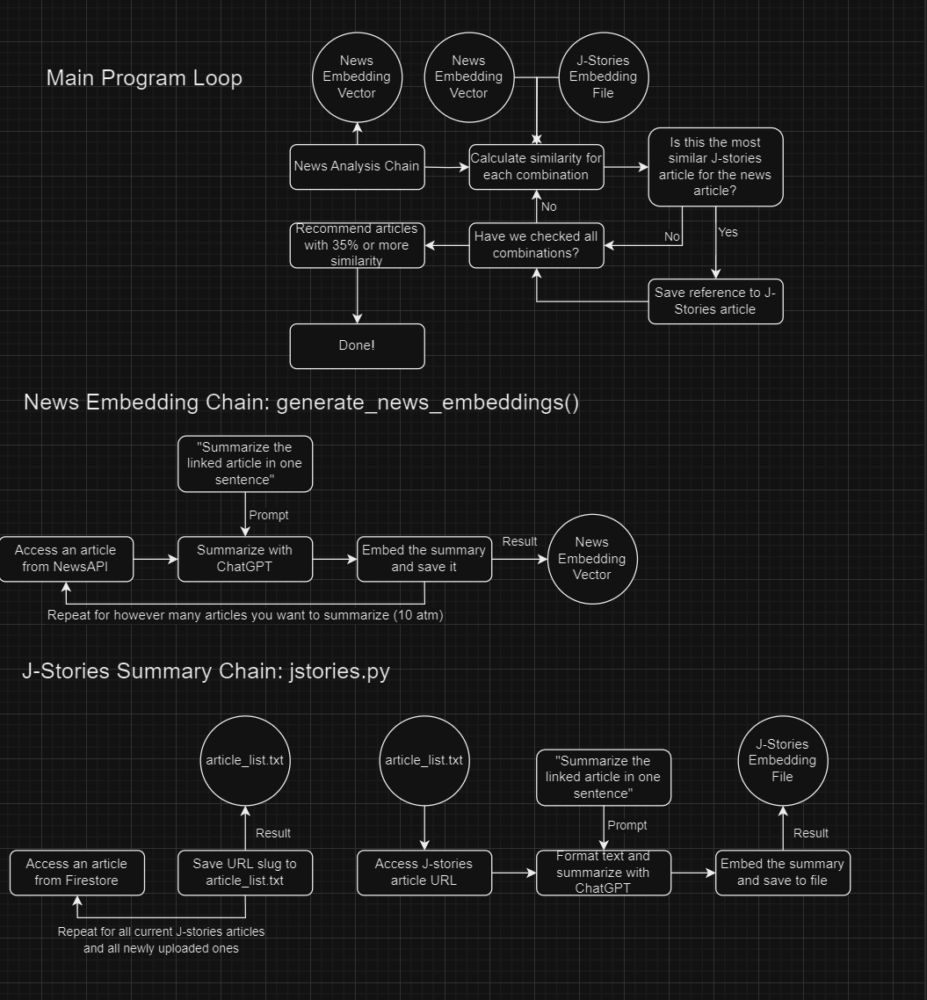

# j-stories-research-001

This is a program that gets the top trending science articles from NewsAPI, and based on the contents of these articles, finds similar articles among a news database to recommend to the user.

## Requirements

In order to run the algorithm, you will need access to the following packages:
- OpenAI API
- NewsAPI
- Google Cloud Firestore

You will also need a service account key .json file to access the Firestore database of your news website

The python files require a file called article_list.txt, which contains the URL slugs for all articles of your news site.  You can create this file by hand or use a script to generate it, but this is a required file.

## Process

Of the three python files I wrote, main.py and jstories.py are the two most important ones.  Scripts.py only contains helper functions that I use heavily in the other two.

Here is a diagram of the main program loop and its main functions:

### jstories.py

This file is a setup file. This one only requires article_list.txt.  It's main function is to generate a list of embeddings for all J-stories articles in the .txt file and save it to a file called jstories_embeddings.txt.

Here's how it works:
- Creates a link to the J-stories article using a slug from article_list.txt
- Passes it to ChatGPT to be summarized
- Passes the summary to an embedding model
- Cleans the embedding by removing [] characters
- Saves it to jstories_embeddings.txt
- Repeats for all articles

At the end, you will have the jstories_embeddings file all set up

### main.py

This file is the one that contains the main program logic, and accesses real news articles from around the world for ChatGPT to analyze.
It requires two .txt files, article_list.txt, and jstories_embeddings.txt.

It performs the following tasks:
- Gets the top news articles, then summarizes and embeds them
- Formats the J-stories embedding file into a list for easy access
- Calculates the cosine similarity for all J-stories articles compared to all news articles
- Prints the combinations above a 35% similarity

Right now this file is only limited to text output, but later it can be integrated into the J-stories website to create a link to the J-stories article

## How to use

Initial setup:
- Download the repository
- Install the packages listed in requirements.txt (in the same directory as the repository)

To run one of the files, all you need to do is run it in the terminal or VSCode using:
`python [filename].py`
Any output will be displayed in the terminal, and created files will automatically appear in the directory you saved this project to.
